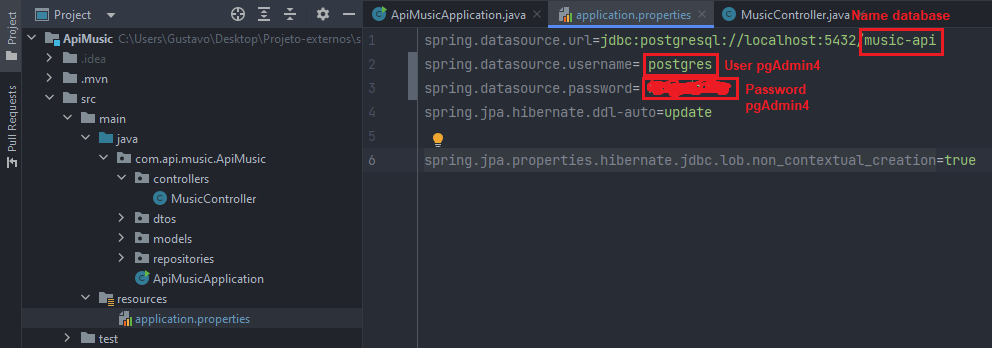

<h1>APIs Java Spring Boot Backend</h1>

## Required tools
IDEA: [IntelliJ IDEA Community](https://www.jetbrains.com/idea/download/?section=windows) &nbsp;&middot;&nbsp;  
API Testing: [Postman](https://www.postman.com/downloads/) &nbsp;&middot;&nbsp;  
Database(POSTGRESQL): [PgAdmin 4](https://www.pgadmin.org/download/) &nbsp;&middot;&nbsp;  
Language: [Java 17 or higher](https://www.oracle.com/br/java/technologies/downloads/) &nbsp;&middot;&nbsp; 

## How to config PgAdmin4
<a>1 - Open and log in to pgadmin4</a>  
<a>2 - Create a database with a name related to the desired api</a>  
  

## How to use project in IntelliJ IDEA
<a>1 - Clone project with comando in bash: git clone https://github.com/Gustavocorrea0/api-spring-boot-backend.git</a>  
<a>2 - Extract the project with zip<a/>   
<a>3 - Open IntelliJ IDEA and clink in "OPEN"<a/>   
   
<a>4 - Select the folder to which the project was extracted and select the "pom.xml" file and click "OK"<a/>   
  
<a>5 - Wait for the dependencies to be installed<a/>   
<a>6 - Access the application.properties file and change the data in red<a/>  
  
<a>7 - Start the project</a>  
  

## How to test API in Postman
<a>1 - Create a collection</a>  
  
  

## Methods
<a>1 - POST</a>  
  
<a>2 - GET ONE</a>  
  
<a>3 - GET ALL</a>  
  
<a>4 - PUT</a>  
  
<a>5 - DELETE</a>  
  

## Thank you for accessing my project
My Linkedln: [Linkedln](www.linkedin.com/in/gustavo-correa00) &nbsp;&middot;&nbsp;  